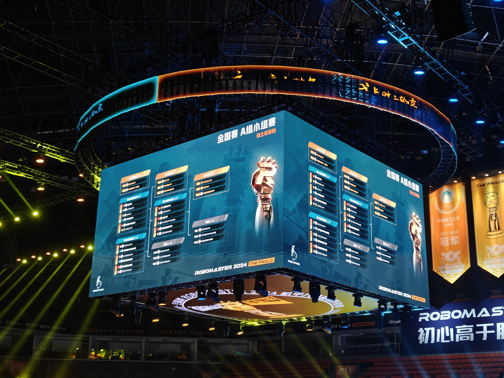
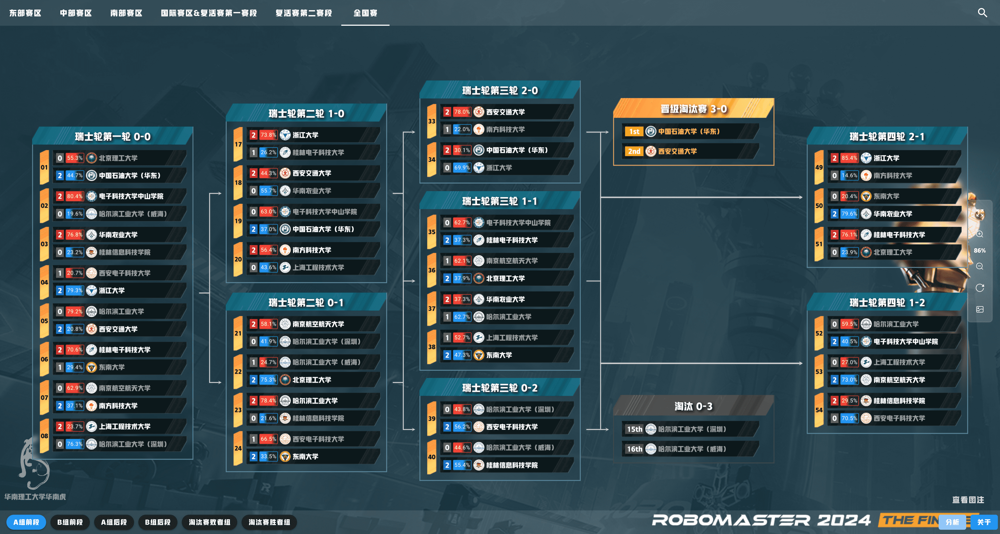
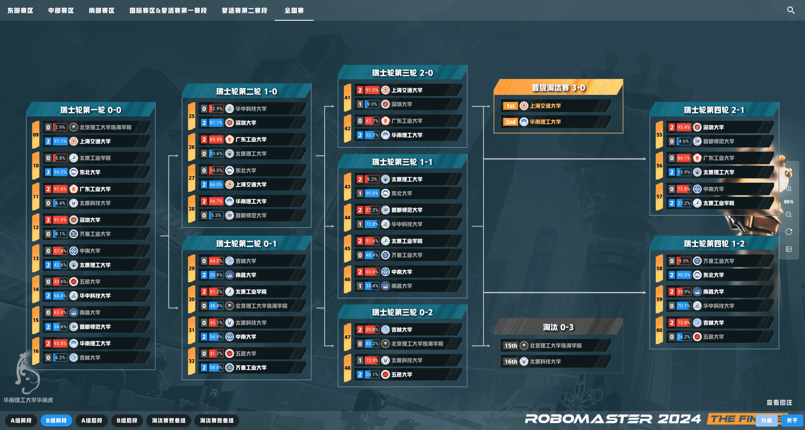
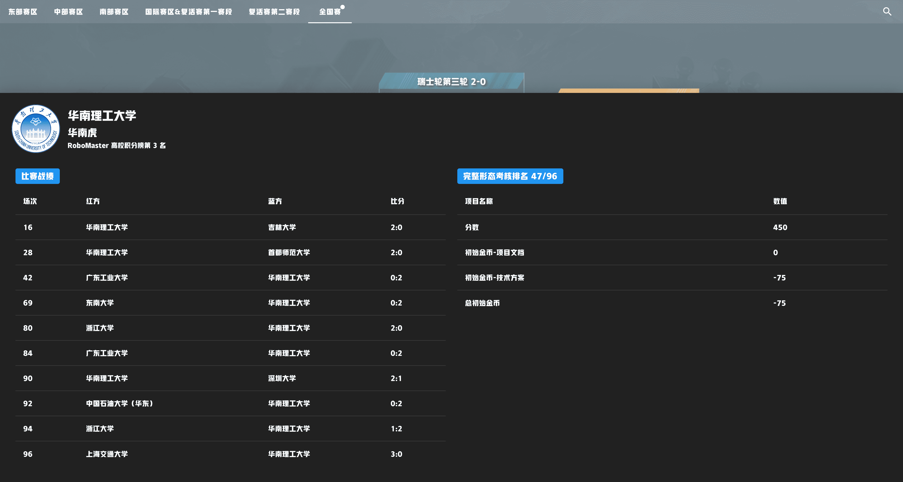
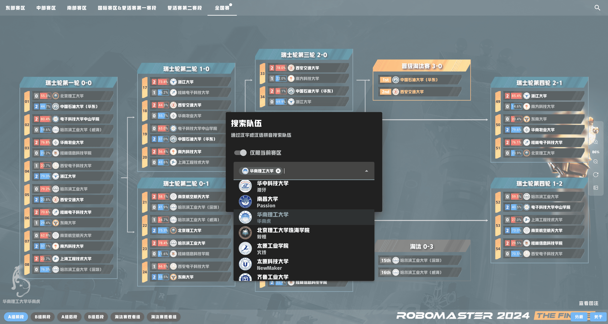

# RoboMaster 赛程分析软件 UI

正式环境 https://schedule.scutbot.cn/

这是前端仓库，后端仓库见 https://github.com/scutrobotlab/rm-schedule

## 功能介绍

在本赛季的 RoboMaster 赛事中，小组赛的赛制由循环赛变成了瑞士轮。

由于瑞士轮的赛制更加复杂且充满变数，参赛方和观赛方很难在短时间内理解晋级路线。

为此，华南虎软件开发组研发了RM赛程分析软件，帮助队伍一图看懂对阵情况。

## 发展历史

### 孵化阶段

2024年5月15日，在23赛季信息组组长常霆钰和宣运组组长杨卓石的合作下，
软件仅历时不到一天即完成开发、上线和宣传。

### 探索阶段

2024年5月17日，研发人员从广州飞往苏州，并与组委会探讨该软件的后续发展。
双方一拍即可，华南虎软件开发组继续优化软件，组委会为软件提供宣传支持。

### 区域赛阶段

此后，该软件的入口出现在了官网直播的滚动横幅，每天早中晚由解说通过口播推广该软件。
研发人员参与了中部区域赛和南部区域赛，并在云浩老师的建议下增加了搜索、选中等功能。

### 全国赛阶段

复活赛和全国赛期间，赛程分析软件适配了赛事直播的风格和字体，并设计了专用的直播模式。
导播可以下载透明底图，经过简单的修改即可用于赛事直播，大大地节省了工作量。
复活赛和全国赛期间，超过九成的直播赛程对阵图使用该软件生成。



## 效果展示

### 使用说明

打开赛程分析软件的官网后，可以看到本赛区当前赛段下的对阵图。


通过上方的菜单栏可以切换赛区，通过下方的菜单栏可以切换赛段。

对于已经确认对阵双方的比赛，每一局比赛都会显示比赛序号、当前比分、对阵双方的校徽和校名。

每支队伍左侧会显示RM王牌预言家小程序的投票支持率，鼠标悬浮在比赛上方即可显示比赛的开始时间。


对于尚未确认对阵双方的比赛，当前轮次的下一轮将按照官方直播的积分情况计算排名，并实时滚榜更新。

对于晋级或淘汰等不属于比赛对阵的内容，软件将根据已有的数据推测并实时更新，直至官网确认最终结果。

选中一所学校后，点击右下角的分析即可进入分析面板。 分析面板会显示该学校在本赛区中的历史对阵情况和完整形态考核成绩。


你也可以点击右上角的搜索按钮，通过汉字或拼音快速搜索学校进行分析。


### 数据分析

从2024年8月1日至8月11日，该软件的CDN总共下发了742GB的流量，响应了521万次请求。

从访问用户区域分布可以看出，比赛场馆所在的广东省发起了超过半数的请求。

单日请求次数的峰值为8月9日的115万次，独立IP访问数的峰值为8月8日的2286次。

从访问量可以看出，复活赛和全国赛期间，该软件深受参赛队伍和工作人员的喜爱。

## 技术方案

### 依赖工具

- Vue.js 框架
- yarn 依赖管理
- Vite 构建工具
- TypeScript 语言
- Vuetify UI 框架
- pinia 状态管理

### 编译方式

直接编译

```bash
yarn install
yarn run build
```

构建 Docker 镜像

```bash
docker build --platform linux/amd64 -t registry.cn-guangzhou.aliyuncs.com/scutrobot/rm-schedule-ui:latest .
```

推送 Docker 镜像

```bash
docker push registry.cn-guangzhou.aliyuncs.com/scutrobot/rm-schedule-ui:latest
```

### 目录结构

```text
.
├── Dockerfile
├── LICENSE
├── README.md
├── etc 配置文件
│ └── default.conf
├── index.html 主页
├── package.json
├── public 公开资源
│ ├── favicon.ico
│ └── ...
├── src 源代码
│ ├── App.vue 根组件
│ ├── assets 静态资源
│ │ ├── ...
│ ├── auto-imports.d.ts 自动导入声明
│ ├── components 组件
│ │ ├── ...
│ ├── components.d.ts 组件声明
│ ├── constant 常量
│ │ ├── ...
│ ├── layouts 布局
│ │ ├── ...
│ ├── main.ts 主函数
│ ├── pages 页面
│ │ ├── ...
│ ├── plugins 插件
│ │ ├── ...
│ ├── router 路由
│ │ └── index.ts
│ ├── stores 状态管理
│ │ ├── ...
│ ├── styles 样式
│ │ ├── ...
│ ├── typed-router.d.ts 路由声明
│ ├── types 类型
│ │ ├── ...
│ └── vite-env.d.ts 环境变量声明
├── tsconfig.json TypeScript 配置
├── tsconfig.node.json Node.js 配置
├── vite.config.mts Vite 配置
└── yarn.lock 依赖锁
```

## RoadMap

- [ ] 打造成 RoboMaster 必备工具站
- [ ] 实现对一支队伍更多维度的分析
- [ ] 支持 RoboMaster 联盟赛和北美站
- [ ] 完善 QA 流程，减少软件错误
    - 本赛季软件没有出现过逻辑性硬伤，但在复活赛期间出现过文案错误，被飞镖群群友捉虫
- [ ] 优化缓存策略，争取下赛季不被 DJI 的 CDN 识别成恶意流量（逃
    - 全国赛进行到中途，我们王牌预言家的数据显示不出来，经过排查我们的服务器 IP 已被源站封禁

## 贡献者

### 研发人员

[常霆钰](https://github.com/1067088037) 开发和运维

[罗棨文](https://github.com/wintbiit) 运维

### 宣传人员

杨卓石、卢佳羽、徐晴

### RoboMaster 组委会

陈欢、叶楚天、张蔼婷、陈琳睿

## 致谢

特别感谢 RoboMaster 组委会提供的支持。
