# RoboMaster 赛程分析软件 UI

<p align="center">
  
</p>

> 华南理工大学华南虎战队自研赛程分析软件，实时更新、智能推演对阵信息，带你一图看懂瑞士轮。

- 正式环境：[https://schedule.scutbot.cn/](https://schedule.scutbot.cn/)
- 前端仓库：[https://github.com/scutrobotlab/rm-schedule-ui](https://github.com/scutrobotlab/rm-schedule-ui)
- 后端仓库：[https://github.com/scutrobotlab/rm-schedule](https://github.com/scutrobotlab/rm-schedule)
- [RoboMaster 开源报告](https://bbs.robomaster.com/article/54068?source=8)

本仓库是 RM Schedule 的 Vue 前端。完整的数据查询、战队与比赛分析、视频回放、竞猜海报和服务端赛程图导出依赖后端服务。

## 演示视频

<a href="https://www.bilibili.com/video/BV1rH3d6REpF">
  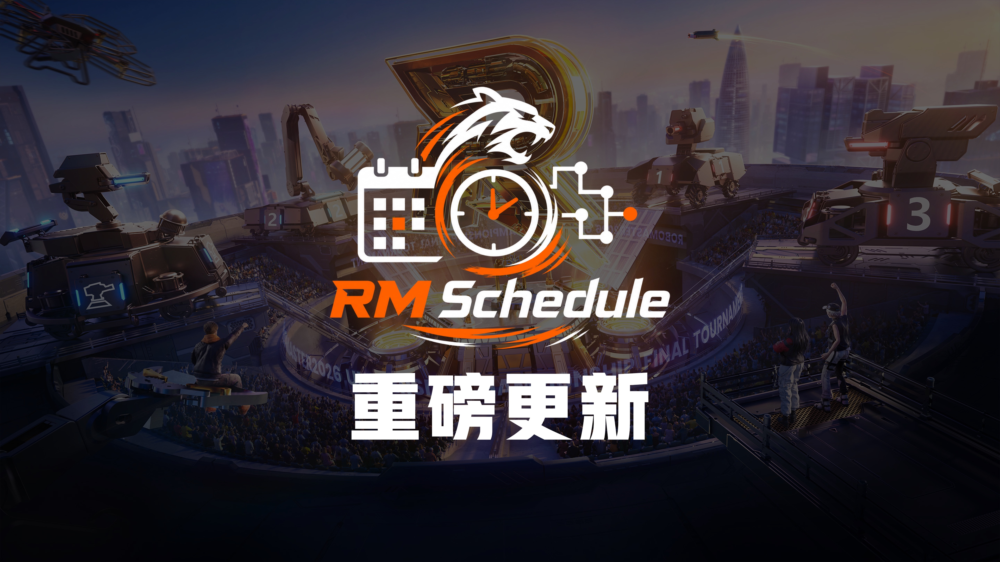
</a>

点击封面观看《全新 RM Schedule 移动端｜读懂每一条晋级之路》，了解两列默认视图、队伍搜索与高亮、长校名滚动、长按快捷菜单、横向浏览及一至六列语义缩放。

## 项目背景

RoboMaster 超级对抗赛小组赛从循环赛改为瑞士轮后，下一轮对阵不仅取决于当前胜负，还与实时排名、对手分及赛事编排规则相关。传统赛程表难以同时表达已确定赛果、尚未确定的席位来源、晋级与淘汰路线。

RM Schedule 将官方赛程数据、排名数据与预先配置的赛制结构组合成可交互的赛程图，帮助参赛队伍、观众、解说和导播快速理解比赛进程。项目目前覆盖 2024-2026 赛季的区域赛、复活赛与全国赛，并同时提供经典桌面赛程图和面向移动端重新设计的 Bracket UI。

> 尚未确认的对阵、晋级和淘汰信息属于基于当前数据的实时推测；最终结果以 RoboMaster 官方发布为准。

## 功能全景

### 多赛季、多赛制赛程图

- 支持 2024、2025、2026 三个赛季，以及区域赛、复活赛和全国赛。
- 展示比赛编号、状态、比分、队伍名称、校徽、预计开始时间和席位来源。
- 适配瑞士轮、循环赛、名额争夺战、单败与双败淘汰等结构。
- 根据实时排名推测下一轮对阵、晋级和淘汰路线，官方结果确认后自动替换预测信息。
- 进行中的赛区每 30 秒刷新；页面恢复可见时立即刷新。已经归档的历史赛区停止轮询。

### 经典版与移动端焕新版

经典版使用关系图完整展示赛程，适合桌面浏览、直播展示和图片导出。移动端焕新版将赛程转换为列式 Bracket：

- 默认以两列呈现晋级路线，并支持从一列特写缩放至六列全局视角。
- 支持阶段范围选择、拖拽平移、边缘缩放、松手吸附和边界回弹。
- 根据可见阶段数量自动调整卡片密度、标题、席位来源和队名长度。
- 搜索或点击队伍后，会同步高亮该队伍在当前赛程中的全部比赛席位；两列模式下，选中的超长校名会循环滚动显示。
- 长按队伍可打开快捷菜单，查看比赛回放、战队或比赛分析，并跳转战队 Bilibili 主页。
- 支持胜者组、败者组、晋级、淘汰、结果等节点及连接线。
- 适配 iOS 安全区、窄屏、横竖屏变化及移动端触摸操作。
- 用户可切换回经典版；后端也可按稳定浏览器分桶配置移动端灰度。

#### 移动端设计理念

经典版最初主要服务赛事直播和横屏展示，完整但密集的赛程图并不适合直接缩放到手机屏幕。移动端焕新版参考美加墨世界杯赛程页面的移动交互，围绕“两列看清晋级路线”重新组织信息：默认保留当前阶段与下一阶段的上下文，同时允许用户在一列特写和六列全局视角之间连续切换。

缩放并非简单改变页面尺寸，而是进行“语义缩放”：系统根据可见列数重新决定比分、队名、席位来源、类型标签和占位图标的显示优先级。局部视角强调单场信息，全局视角强调赛程结构，使每一级缩放都保持与当前阅读目标匹配的信息密度。

### 搜索、战队与比赛分析

- 使用学校名、队伍名、汉字或汉语拼音搜索战队。
- 可限定当前赛区；跨赛区选中战队时自动切换到该战队参加的最新赛区。
- 展示历史比赛、小组赛成绩、完整形态考核排名和各兵种关键数据。
- 使用雷达图对比战队数据、全局平均值和全局最高值。
- 对比红蓝双方排名、机器人数据、雷达图和历史交手记录。
- 自动匹配并内嵌 Bilibili 比赛回放，支持跳转战队 Bilibili 主页。
- 根据赛季数据口径处理指标，例如 2026 赛季工程机器人装配经济和新版飞镖加权得分。

### 竞猜海报与自动导图

- `/forecast` 提供“王牌预言家”竞猜海报预览，展示双方、校徽、支持率与截止时间。
- 海报设计画幅为 1920×1080，可下载 3840×2160 PNG。
- 导出页面供后端通过无头浏览器生成赛程 PNG；测试环境导出图会附加测试标识。

### 运行时环境控制

前端通过 `/api/config` 读取测试环境标志和移动端 Bracket 配置。请求失败时回退到正式环境和对照组。测试环境显示固定标识；预测海报、导出和独立 Bracket 页面不会自动弹出全局公告，以免遮挡页面或导出图片。

## 使用说明

1. 打开正式环境，页面会进入最新赛季的默认赛区。
2. 使用顶部菜单切换赛季和赛区，使用赛段控件切换小组赛、名额争夺战或淘汰赛。
3. 点击战队可选中或取消选中；搜索按钮支持汉字或拼音查找。
4. 选中战队后打开“分析队伍”，查看历史战绩、排名和机器人数据。
5. 点击已确定双方的比赛，查看回放、比赛分析和战队主页入口。
6. 移动端焕新版默认显示两列；可拖动选区平移赛程，或拖动边缘在一至六列间切换视野。
7. 点击队伍可高亮其全部比赛席位；长按队伍可打开回放与数据分析快捷菜单。

## 效果展示与定量分析

### 2026 赛季界面示例

桌面端赛程图集中展示完整淘汰路径、比赛结果和队伍支持率，并支持平移、缩放与赛段切换。

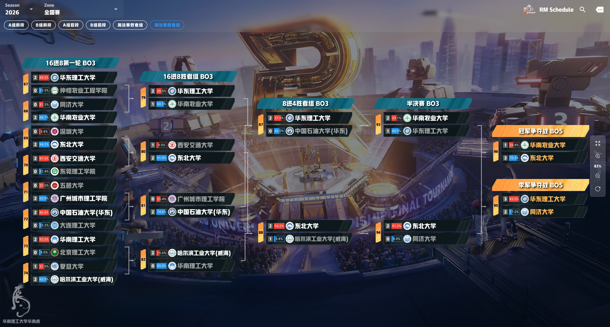

移动端焕新版默认使用两列视野，便于沿晋级路径阅读相邻轮次；下图同时展示五列视野，可在一屏中查看小组赛进程、晋级排名和淘汰结果。

<table>
  <thead>
    <tr>
      <th align="center">双列视野</th>
      <th align="center">五列全局视野</th>
    </tr>
  </thead>
  <tbody>
    <tr>
      <td width="50%" align="center">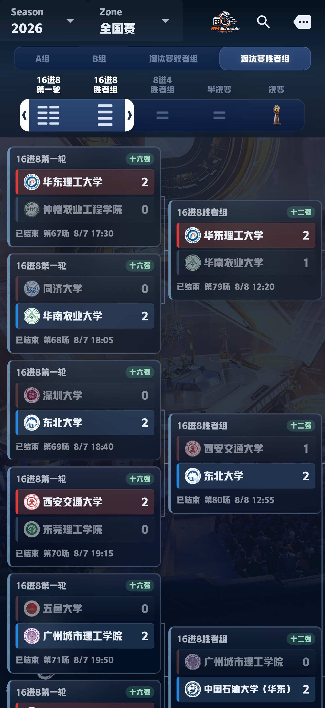</td>
      <td width="50%" align="center">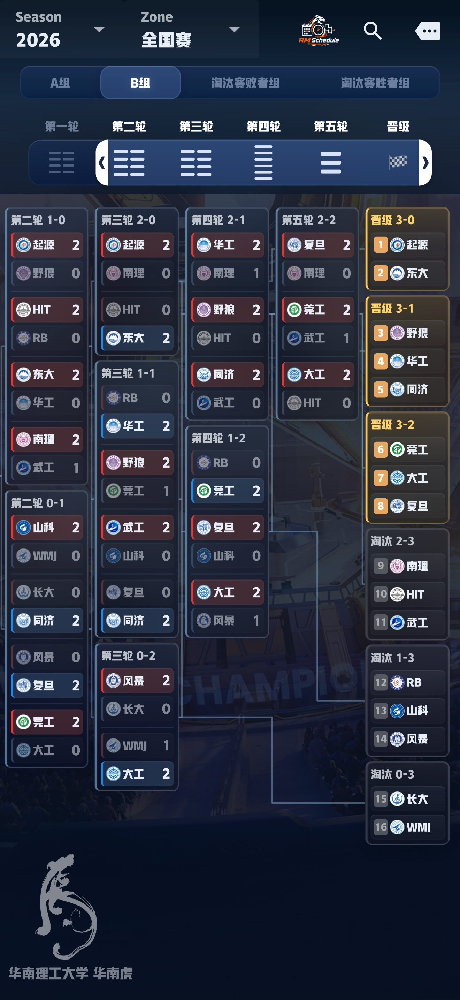</td>
    </tr>
  </tbody>
</table>

战队分析汇总比赛战绩、形态考核、机器人数据与雷达图。

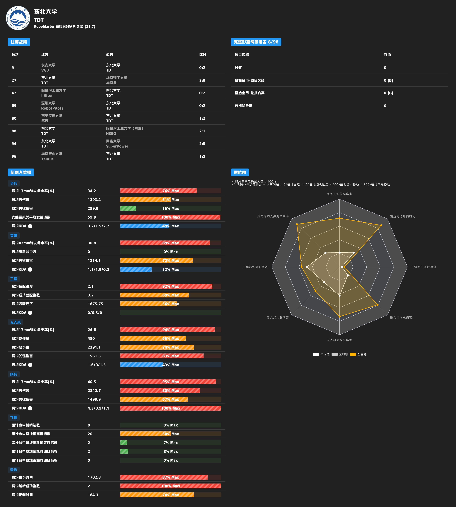

比赛分析并列呈现双方机器人指标、历史战绩和能力分布，辅助赛前与赛后复盘。

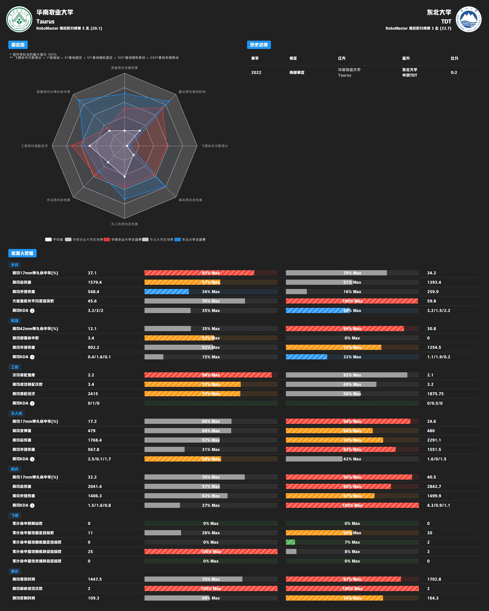

竞猜功能可生成 3840×2160 PNG 海报，用于分享赛前支持率与对阵信息。

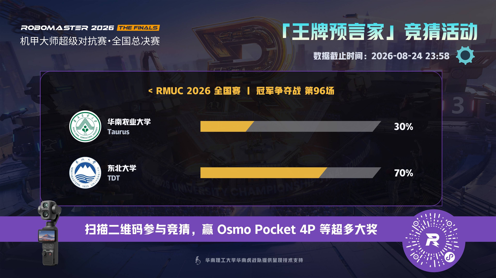

### 赛事现场大屏

复活赛和全国赛期间，导播可下载透明底图用于现场大屏。

**2024 全国赛现场大屏：**

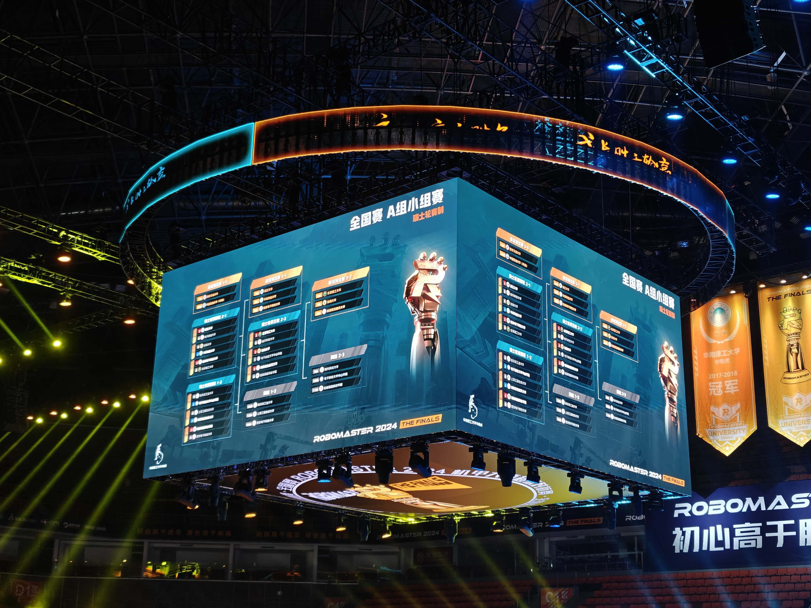

**2025 全国赛现场大屏：**

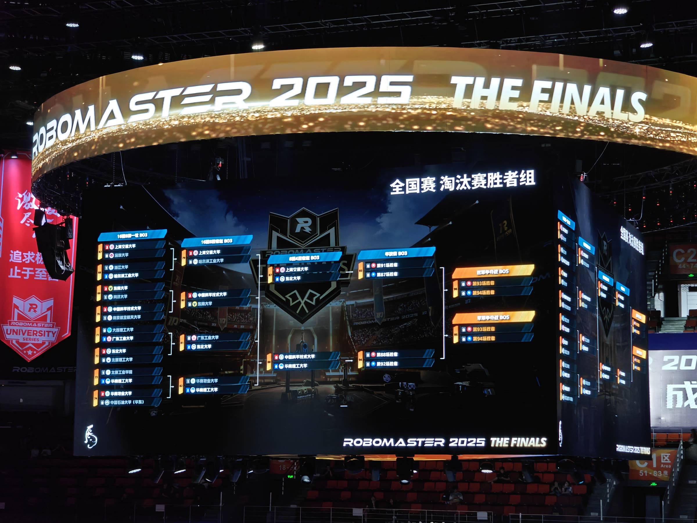

**2026 全国赛现场大屏：**

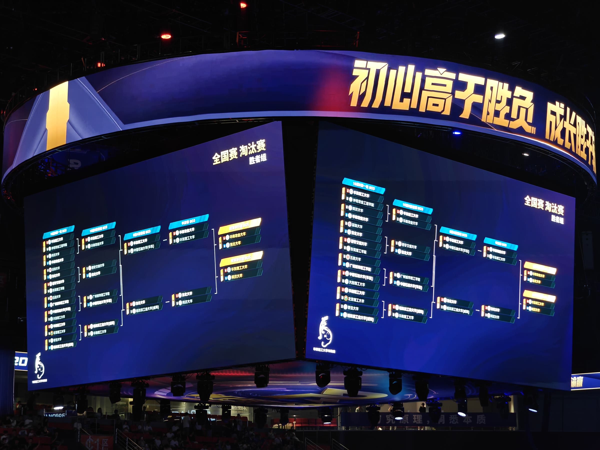

### 2026 全国赛访问数据

以下访问数据统计范围为 **2026 年 7 月 29 日至 8 月 11 日**：

- 浏览量（PV）：56,756。
- 访客数（UV）：16,960。
- 独立 IP 数：18,026。
- 平均访问时长：5 分 45 秒。
- 8 月 7 日达到统计周期峰值，当日浏览量（PV）为 9,286，访客数（UV）为 2,379。

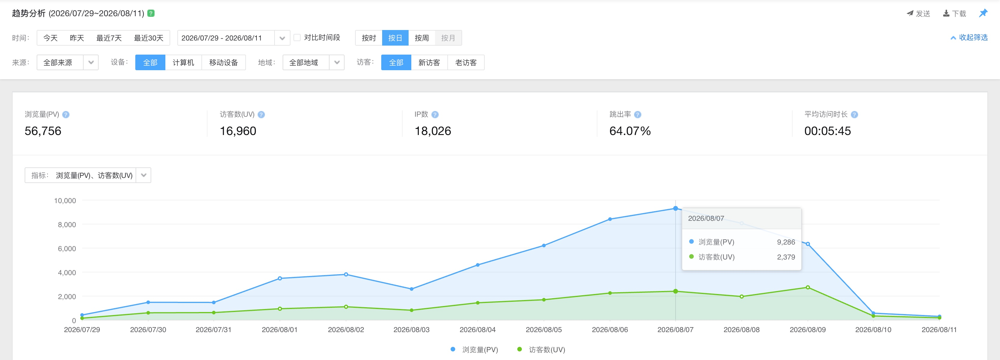

## 技术原理与理论支持

### 从赛制配置到可视化模型

项目将“不会随实时比分改变的赛制结构”和“持续更新的比赛数据”分开维护：

1. `ZoneMap` 注册赛季、赛区和默认赛段。
2. 每个赛区由若干 `Part` 组成，分别描述小组赛、名额争夺战或淘汰赛。
3. `ZoneJsonData` 描述阶段、节点、比赛编号、席位来源、连接线和预测位置。
4. 后端 `/api/schedule` 提供实时队伍、比分、状态与比赛时间。
5. 经典版直接组合配置与实时数据；焕新版通过适配器生成 `BracketViewModel`，再由列、卡片和连接线组件渲染。

这种分层避免把每个赛季的赛制差异写入通用渲染组件，也使历史赛程能够使用同一套模型回放。

### 席位、赛果与赛段合并

赛程位置可能来自固定战队、某组实时排名、上一场胜者或败者，也可能尚未确定。适配层将来源统一转换为战队席位或说明性占位，并在比赛确认后优先展示实时战队和比分。淘汰赛结合比赛状态与比分解析胜者、败者、晋级和淘汰节点。

部分赛区在配置中按前后半程拆分。Bracket 适配前先合并相同赛段的节点、连线和预测数据，再保留独立淘汰赛部分，避免移动端出现人为拆分的重复赛段。

### 淘汰树布局与响应式密度

项目根据每列节点数量和父子关系计算淘汰树纵向位置，再校正锚点和列间距。可见列增加时，系统逐级压缩间距、隐藏低优先级标签、缩短比赛标题和席位来源，并使用后端提供的队名简称；可见列减少时恢复完整信息。阶段选区拖动期间连续跟手，松手后吸附到整数列，保证最终布局稳定。

### 实时预测边界

对于官方尚未确定的下一轮对阵，前端根据当前排名数据和赛制配置填充预测席位，并使用视觉样式区分预测与确定结果。预测会随数据刷新而改变；比赛双方、晋级或淘汰结果一旦由官方确认，即以官方数据为准。

### 机器人数据处理

前端按机器人类型聚合关键指标，计算有效战队的平均值与单项最大值，用于表格和雷达图比较。不同赛季规则口径不同时使用不同转换方法，例如 2026 赛季工程机器人使用装配经济，飞镖使用包含随机移动目标和末端移动目标的新版加权得分。指标定义与规则应以对应赛季官方规则手册为准。

### 设计模式与设计方法

项目在复杂赛制转换中采用适配器模式。`buildBracketViewModel` 位于赛制配置、实时数据与界面组件之间，将不同赛季的 `Part`、`ZoneJsonData`、比赛和排名数据统一转换为 `BracketViewModel`。Bracket 的列、卡片和连接线组件只依赖统一视图模型，不需要感知各赛季字段和赛制差异。

适配器通过 `getMatchByOrder`、`getGroupPlayerByRank` 和 `getPlayerById` 等回调获取外部数据，而不是直接依赖 Pinia Store。这种依赖注入使领域转换可以脱离页面和网络请求独立测试，也便于替换数据来源。

赛季与赛区差异采用配置驱动的策略选择：`ZoneMap` 为每个赛区组合不同的 `Part`、赛制结构、轮次顺序和预测配置，通用渲染流程根据配置运行，而不是在组件中堆叠赛季判断。应用状态则通过 Pinia Store 集中管理，形成“API → Store → 领域适配 → 视图”的单向数据流，减少页面之间直接共享和修改数据。

## 开源复用价值

RM Schedule 不仅提供可运行的赛程网站，也将复杂赛事可视化拆分为可独立参考的配置、转换、布局和交互模块：

- **赛制配置与实时数据分离**：其他队伍可以参考 `ZoneMap → Part → ZoneJsonData` 的组织方式，为新赛季或其他赛事维护稳定的图结构，再通过接口填充实时比分和排名，不必为每届比赛重写渲染组件。
- **统一视图模型适配**：`Bracket Adapter` 演示了如何把小组排名、固定席位、胜者、败者和预测席位转换为统一的 `BracketViewModel`，适合复用于双败淘汰、名额争夺和多阶段晋级图。
- **可测试的淘汰树布局**：赛段合并、节点定位、连接关系和响应式信息密度由独立工具函数处理，并配有单元测试，可作为移动端赛程图、赛事看板或直播图形系统的实现参考。
- **移动端复杂信息交互**：阶段范围拖动、边缘缩放、松手吸附和语义缩放展示了如何在窄屏中同时保留局部比赛信息与全局晋级关系。
- **媒体素材自动生成**：竞猜海报与赛程图导出流程可供赛事运营和现场大屏场景参考，将实时数据转换为可重复生成的高清图片。

复用时通常只需替换赛区配置、后端数据接口、视觉资源和指标口径。涉及预测的内容仍需按照目标赛事的官方编排规则重新校验，不能直接沿用现有赛季结论。

## 系统架构与数据流

### 系统框图

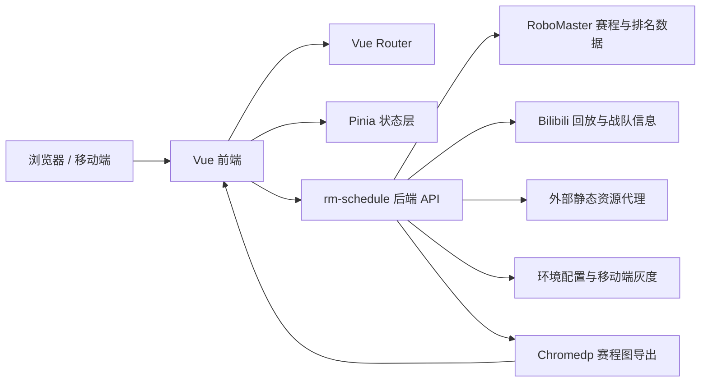
```mermaid
flowchart LR
    U[浏览器 / 移动端] --> FE[Vue 前端]
    FE --> ROUTER[Vue Router]
    FE --> STORE[Pinia 状态层]
    FE --> API[rm-schedule 后端 API]
    API --> RM[RoboMaster 赛程与排名数据]
    API --> BI[Bilibili 回放与战队信息]
    API --> STATIC[外部静态资源代理]
    API --> CONFIG[环境配置与移动端灰度]
    API --> CHROME[Chromedp 赛程图导出]
    CHROME --> FE
```

### 数据流图

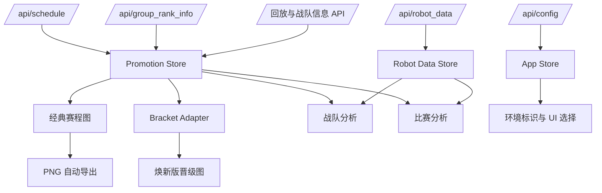
```mermaid
flowchart TD
    S[/api/schedule/] --> PS[Promotion Store]
    G[/api/group_rank_info/] --> PS
    R[/api/robot_data/] --> RS[Robot Data Store]
    C[/api/config/] --> AS[App Store]
    V[/回放与战队信息 API/] --> PS
    PS --> LEGACY[经典赛程图]
    PS --> ADAPTER[Bracket Adapter]
    ADAPTER --> BRACKET[焕新版晋级图]
    PS --> TEAM[战队分析]
    RS --> TEAM
    PS --> MATCH[比赛分析]
    RS --> MATCH
    LEGACY --> EXPORT[PNG 自动导出]
    AS --> UI[环境标识与 UI 选择]
```

### 软件层级

```text
页面层
├── 经典赛程页 / 移动端 Bracket 页
├── 竞猜海报页
└── PNG 导出页

业务组件层
├── 赛程图、阶段选择器、比赛卡片和连接线
├── 搜索、战队分析和比赛分析
├── 视频回放与战队主页联动
└── 公告、菜单和环境标识

状态与数据层
├── App Store：运行环境、UI 偏好和全局弹窗
├── Promotion Store：赛程、排名、比赛和战队信息
└── Robot Data Store：机器人原始数据与聚合指标

领域转换层
├── Bracket Adapter / Part Merge / Tree Layout
├── Forecast Rank / Group Rank / Stage Teams
└── Responsive Density / Route / Refresh 策略

基础设施层
├── Axios API / Vue Router / Pinia
├── ECharts / Relation Graph / Bilibili Embed
└── Canvas PNG / Chromedp
```

## 技术栈与运行环境

- Vue 3、TypeScript、Vue Router
- Vite 6、Vue TSC、Vitest
- Vuetify 3、Sass、Pinia、Axios
- ECharts、Relation Graph Vue 3
- Pinyin Match、Vue Bilibili Embed Renderer
- Nginx、Docker

### 软硬件运行环境

- **客户端**：运行于支持现代 Web 标准的桌面或移动浏览器；桌面端使用鼠标操作，移动端支持触摸、横竖屏变化和 iOS 安全区。
- **服务端**：生产环境可使用 Nginx 托管前端静态文件；赛程、排名、分析、回放、运行时配置和赛程图导出依赖 `rm-schedule` 后端服务。
- **硬件要求**：前端不依赖机器人、裁判系统或其他专用硬件，普通电脑、平板或手机即可访问。服务端赛程图导出需要能够运行 Chromium/Chromedp 的后端环境，具体配置见后端仓库 README。

仓库尚未通过 `.nvmrc`、`.node-version` 或 `engines` 锁定本地 Node.js 版本。当前 Docker 构建阶段使用 `node:18-alpine`，因此容器构建基线是 Node.js 18；维护者仍需为本地开发正式锁定并验证 Node.js 版本。

本地文档和脚本以 Yarn Classic 为例；当前 Dockerfile 使用 Corepack + pnpm。两种安装路径不应混用同一工作目录中的锁文件，后续应统一包管理器并只保留对应锁文件。

## 安装、开发与构建

### 前置条件

- Node.js：Docker 基线为 18；本地精确支持版本待维护者锁定。
- Yarn Classic：当前开发命令示例使用 Yarn 1.x。
- 后端：完整功能需要本地启动 `rm-schedule`，默认监听 `8080`。

### 本地开发

```bash
yarn install
yarn dev
```

Vite 默认监听 [http://localhost:3000](http://localhost:3000)，并将 `/api` 请求代理到 [http://localhost:8080](http://localhost:8080)。

建议同时启动前后端：

```bash
# 终端 A：后端仓库
cd ../rm-schedule
go run .

# 终端 B：本仓库
cd ../rm-schedule-ui
yarn install
yarn dev
```

后端 Chromedp 导图的完整联调配置见后端仓库 README。

### 类型检查、测试和生产构建

```bash
yarn typecheck
yarn test
yarn build
yarn preview
```

`yarn build` 先执行 `vue-tsc --noEmit`，再由 Vite 生成 `dist`。`yarn preview` 仅用于本地预览生产构建。

### Docker

```bash
docker build --platform linux/amd64 \
  -t registry.cn-guangzhou.aliyuncs.com/scutrobot/rm-schedule-ui:latest .

docker push registry.cn-guangzhou.aliyuncs.com/scutrobot/rm-schedule-ui:latest
```

生产镜像使用 Nginx 托管 `dist`，通过 `try_files ... /index.html` 支持 Vue Router History 模式回退。

## 路由与常用参数

| 路径                         | 用途                   | 受众        |
| -------------------------- | -------------------- | --------- |
| `/:season/:zoneId`         | 普通赛程入口；按设备和用户偏好选择 UI | 普通用户      |
| `/:season/:zoneId/bracket` | 显式打开焕新版 Bracket      | 普通用户、测试人员 |
| `/forecast`                | 竞猜海报预览与下载            | 运营、媒体     |
| `/:season/:zoneId/export`  | 向后端导图流程输出 Base64 PNG | 开发、媒体生产   |

普通赛程 Query：

| 参数        | 示例           | 说明                 |
| --------- | ------------ | ------------------ |
| `group`   | `?group=0`   | 选择赛区 `parts` 的原始下标 |
| `predict` | `?predict=1` | 在经典版开放预测显示开关       |
| `live`    | `?live=1`    | 使用经典版直播展示模式        |

导出示例：`/2026/616/export?group=0`

## 目录结构

```text
.
├── docs/                    README 图片与开源报告素材
├── etc/default.conf         Nginx History 路由回退配置
├── public/                  背景与公开赛程资源
├── src/
│   ├── assets/forecast/     竞猜海报素材
│   ├── components/bracket/  Bracket 卡片、列、连接线和画板
│   ├── constant/            各赛季、赛区和赛段图结构配置
│   ├── directives/          文字自动适配等自定义指令
│   ├── layouts/             页面布局
│   ├── pages/               赛程、Bracket、海报和导出页面
│   ├── plugins/             Vuetify 等插件注册
│   ├── router/              路由与入口规范化
│   ├── stores/              Pinia 状态与 API 数据加载
│   ├── styles/              全局字体和主题样式
│   ├── types/               API 响应与领域视图模型
│   ├── utils/               适配、布局、预测、刷新和响应式算法
│   ├── App.vue              根组件与全局环境控制
│   └── main.ts              应用入口
├── Dockerfile               Node 构建与 Nginx 运行镜像
├── LICENSE                  Apache License 2.0
├── package.json             依赖与开发脚本
├── vite.config.mts          Vite、自动导入与开发代理配置
├── vitest.config.ts         单元测试配置
└── tsconfig*.json           TypeScript 配置
```

## 测试与代码质量

项目使用 TypeScript、Vue TSC 和 Vitest 保证类型与核心领域逻辑。测试覆盖：

- 移动设备识别、iOS 安全区和 Bracket UI 偏好。
- 路由规范化、显式 Bracket 路径和历史赛区刷新策略。
- 赛段合并、阶段队伍/比赛数量和多赛季 Bracket 适配。
- 淘汰树布局、连接关系、响应式密度、文字缩写和阶段标签布局。
- 小组排名、预测排名、比赛预测 API 和交互点击判定。
- App、Promotion Store 的配置加载、异常回退和数据更新。

截至本 README 重构时，验证结果为：

```text
Test Files  19 passed (19)
Tests       207 passed (207)
```

`yarn build` 同时通过 TypeScript 检查和生产构建。当前 Vite 构建仍提示主 JavaScript Chunk 压缩后超过 500 kB；这是已知性能优化项，不影响构建成功。

仓库目前以单元测试为主，尚未发现完整的端到端、视觉回归或 API 契约测试，不能将现有测试描述为完整集成测试。代码按页面、组件、状态、领域转换和基础设施职责拆分；公共结构使用 TypeScript 类型约束，复杂赛程转换和布局逻辑配有注释及独立测试。项目在赛制到视图模型的转换边界采用适配器模式，并结合依赖注入、配置驱动和单向状态流；其他模块按实际职责组织，不为套用模式而增加抽象。

## 发展历史

### 2024 区域赛（5-6 月）：从构想到首个可用版本

2024 年 5 月 15 日，为解决瑞士轮赛制难以快速理解的问题，RM Schedule 在不到两天内完成首版开发、上线和宣传。首个版本已经能够获取官方赛程数据，将比赛、排名和预测席位组织为关系图，并展示实时比分、比赛状态与竞猜支持率。此后数周，项目陆续加入赛区切换、定时刷新、画布拖动和缩放等基础能力，使赛程图能够跟随区域赛进程持续更新。

随着研发人员在区域赛现场收集组委会、参赛队伍和观众的反馈，软件进一步加入战队选中、高亮和分析面板，展示历史对阵及完整形态考核信息；搜索功能也从学校名匹配扩展到汉字和拼音检索，并支持限定当前赛区。到区域赛结束时，项目已经形成“查看赛程—理解预测—搜索战队—分析表现”的基础产品闭环。

### 2024 全国赛（7-8 月）：从区域赛工具走向赛事直播

进入复活赛和全国赛后，赛制结构从区域赛瑞士轮扩展到国际赛区、复活赛多赛段、全国赛小组赛和双败淘汰赛。项目为不同阶段补充独立的赛程配置、预测关系和胜败来源，加入败者组、全国赛决赛等复杂结构，并根据现场赛程持续修正比赛编号、轮次、席位顺序和连接关系。

这一阶段的重点同时转向赛事直播场景。前端加入直播模式、赛事字体、全国赛背景和视觉样式，支持生成透明背景的赛程图，便于导播直接用于直播包装；比赛菜单补充预计开始时间等提示，静态资源也通过 CDN 代理提高现场访问稳定性。RM Schedule 因此从面向参赛队伍和观众的辅助工具，进一步成为直播赛程图的生产工具。

### 2025 区域赛（5-6 月）：多赛季架构与数据分析起步

2025 赛季首先完成了多赛季改造：赛季、默认赛区、背景和赛程配置不再固定为 2024 数据，用户可以在同一产品中切换不同赛季。项目同步适配 2025 区域赛小组赛和新版名额争夺赛制，完善实时排名预测、晋级结果和不同赛区的默认入口。

产品能力也开始从“赛程分析”向“战队数据分析”扩展。搜索到不在当前赛区的战队时，页面会自动跳转到该战队参加的最新赛区；随着赛事官网开放机器人关键数据，前端接入各兵种指标，并首次通过雷达图汇总战队的多维表现。完整形态考核也新增文档等级、技术等级等字段，为后续更系统的战队分析奠定基础。

### 2025 全国赛（7-8 月）：形成完整的战队与比赛分析体系

全国赛阶段重点重构并扩展了数据分析模块。机器人数据从单一雷达图演进为关键数据表、进度条、全局平均值和单项最高值对比，并支持区域赛、复活赛和全国赛多赛段数据切换；飞镖命中、KDA、工程取矿时间等指标增加了适合比较的派生计算和说明。

项目同时加入比赛级分析：用户可以在赛程图中选择具体比赛，对比红蓝双方的排名、机器人数据和雷达图，并查看双方历史交手记录。比赛菜单接入 Bilibili 回放和战队主页信息，可在赛程上下文中直接回看比赛或进入战队主页。配合 2025 复活赛、全国赛小组赛与淘汰赛适配，RM Schedule 由赛程查看工具进一步发展为覆盖战队、比赛和历史数据的综合分析平台。

### 2026 区域赛（5-6 月）：适配新规则并提高实时可靠性

2026 区域赛更新了赛季入口、赛区结构、背景和名额争夺赛配置，并针对新赛季数据口径调整分析逻辑，例如工程机器人改用装配经济、飞镖采用包含随机移动目标和末端移动目标的新版加权得分。实时预测也增加更完整的排名展示、席位文本和引导线，帮助用户在比赛尚未全部完成时理解下一阶段可能的对阵关系。

在运行体验上，这一阶段继续完善直播状态、比赛菜单、Bilibili 回放兼容、长校名显示和默认赛区处理。刷新策略开始区分仍在进行的赛区与已经归档的历史赛区，减少无意义请求，同时保留实时比赛所需的数据更新能力，为全国赛期间更大规模的界面重构做好数据和稳定性准备。

### 2026 全国赛（7-8 月）：移动端重构与媒体生产工具链

2026 全国赛前后，项目针对原版偏重横屏和直播、移动端阅读困难的问题，重新构建 Bracket UI。新版以两列晋级路线为默认视图，支持一至六列语义缩放、阶段选区拖拽与边缘缩放、松手吸附、淘汰树动态布局和安全区适配。不同缩放层级会重新决定比分、队名、席位来源和类型标签的信息优先级；点击或搜索队伍可以高亮其全部比赛席位，长按则可打开回放与分析菜单，超长校名在两列模式下自动循环显示。

围绕运营、直播和宣传制作，项目还加入竞猜海报预览与高清 PNG 下载，以及由后端 Chromedp 驱动的赛程图自动导出。测试环境标识、移动端稳定分桶灰度、页面恢复刷新、历史赛区停止轮询和多赛季 Bracket 测试共同保障新界面的发布质量。至此，RM Schedule 形成了从赛程数据适配、交互式可视化和数据分析，到图片生成与直播使用的完整工具链。

整体演进路线可以概括为：**赛程可视化 → 全国赛直播工具 → 多维数据分析平台 → 移动端交互式晋级图与媒体生产工具链。**

## Roadmap

- [ ] 支持关注战队，集中展示其下一场比赛、晋级状态和赛程变化。
- [ ] 提供赛果情景推演，允许用户假设比赛结果并查看后续对阵与晋级路线，同时明确区分模拟结果与官方数据。
- [ ] 增加赛程配置、比赛编号、席位来源和连接关系的自动校验。
- [ ] 建立关键流程的端到端测试和赛程图视觉回归测试。
- [ ] 使用路由级动态加载和依赖拆包降低首屏 JavaScript 体积。

## 贡献者

### 研发与运维

- [常霆钰](https://github.com/1067088037)：开发和运维
- [罗棨文](https://github.com/wintbiit)：运维
- [潘任周](https://github.com/stydxm)：战队分析等后续功能贡献

### 宣传人员

常霆钰、杨卓石、卢佳羽、徐晴

## 开源协议

本项目采用 [Apache License 2.0](LICENSE) 开源。该许可证允许在保留版权、许可证声明并标明修改的前提下使用、修改和分发项目代码，同时包含明确的专利授权条款。项目名称、标识及第三方依赖不因该许可证自动获得额外授权。

## 致谢

特别感谢 RoboMaster 组委会提供支持，感谢各位组委会老师：陈欢、叶楚天、黄欣、辛然、张蔼婷、陈琳睿。

感谢参与数据整理、赛事直播、测试反馈和项目传播的所有队伍与贡献者。
